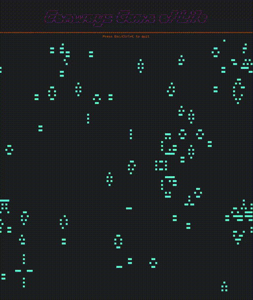

<h1 align="center">Conway's Game of Life</h1>

<h3>
in ASCII
</h3>

 

by: <a href="https://twitter.com/cybergenik" target="_blank">Luciano Remes </a>

### Requirements:
- Golang version >= go1.21.5 linux/amd64

### Usage: 
1. `git clone https://github.com/Cybergenik/cgt && cd cgt`
2. `go run .`
3. ASCII cellular automata! 

***By default assumes that you're terminal size is at least 65x130, but the simulation should resize.***
